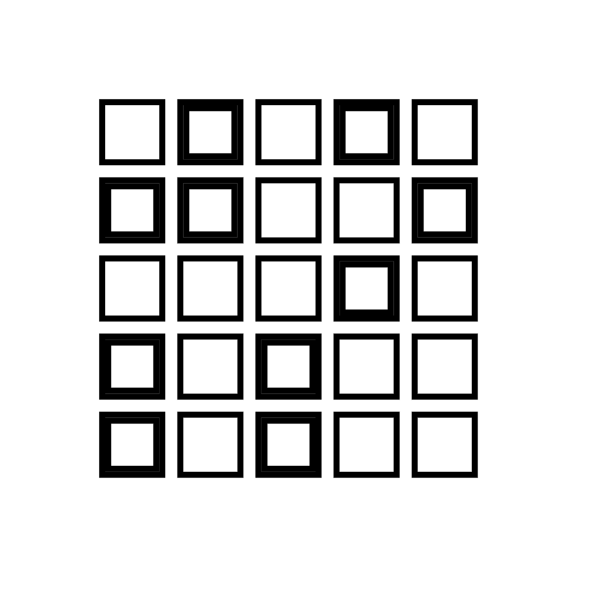
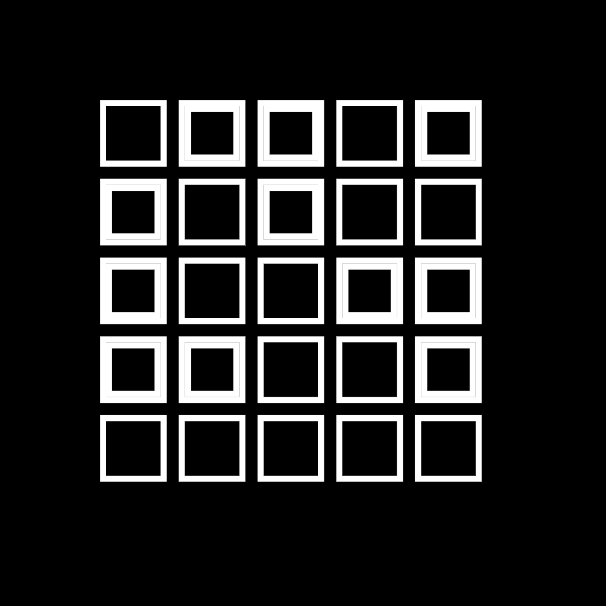

# JavaScript Playground

## Overview

This project is a compilation of hands-on exercises that demonstrate key concepts in JavaScript in a visually appealing manner. The project encapsulates a dynamic array of mini-projects, each focusing on a unique aspect of JavaScript programming - from object creation and animation to DOM event manipulation. Furthermore, the project emphasizes interactive UI elements, like buttons and moving images, providing an engaging platform for immersive learning.

Built within an HTML5 Canvas environment, this project serves as a visual playground.

## Structure

The main body of the project is contained within the files: `playground.js`, `index.html`, and `style.css`. `tutorials/sketch-final2.js` is a rough version that is being re-written in `playground.js`.

The `tutorials` directory includes a collection of sketches from the following course [Creative Coding: Making Visuals with JavaScript](https://www.domestika.org/en/courses/2729-creative-coding-making-visuals-with-javascript).

The `media` directory is split into two parts. The `media/images` directory contains images used in `playground.js`. The `media/output` directory contains images and videos created during the creative coding course.

Here are some images and videos from `media/output` created during the creative coding course:

